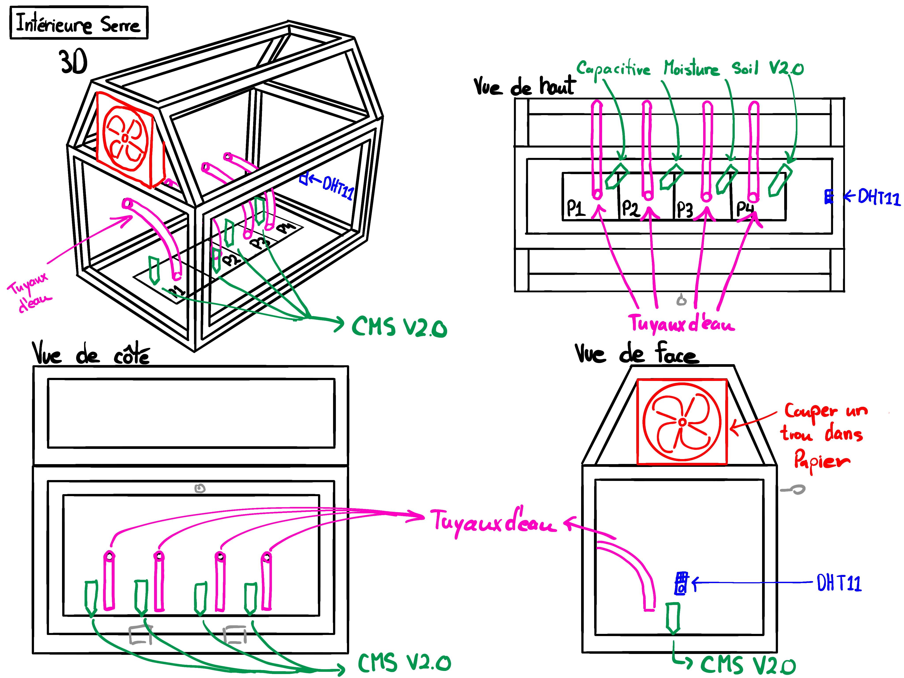
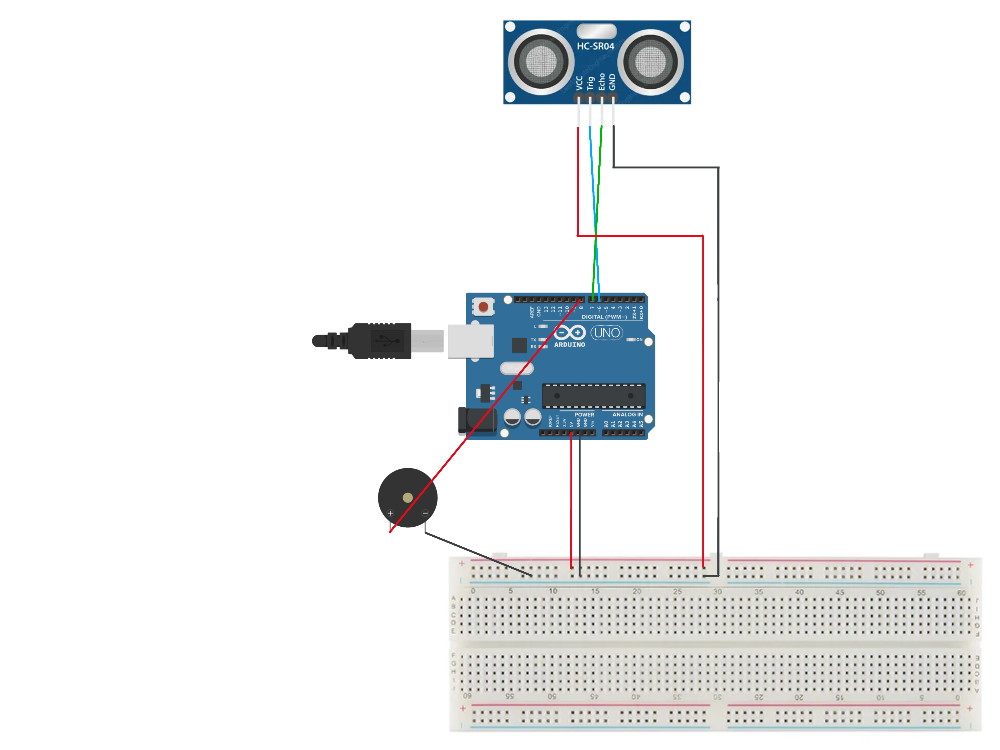
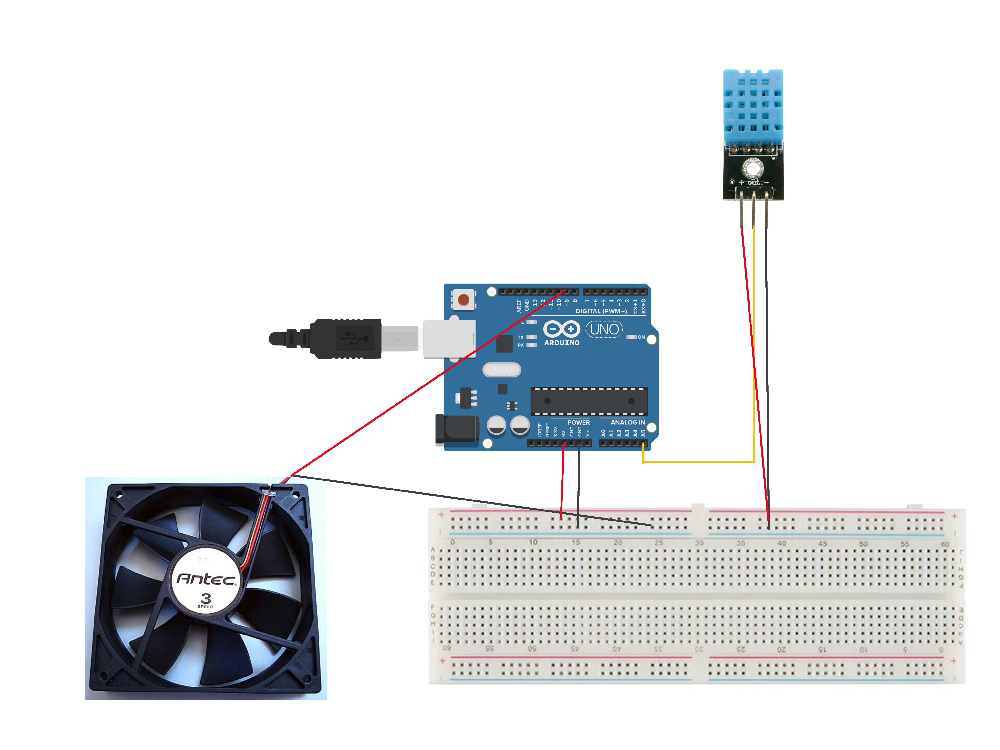
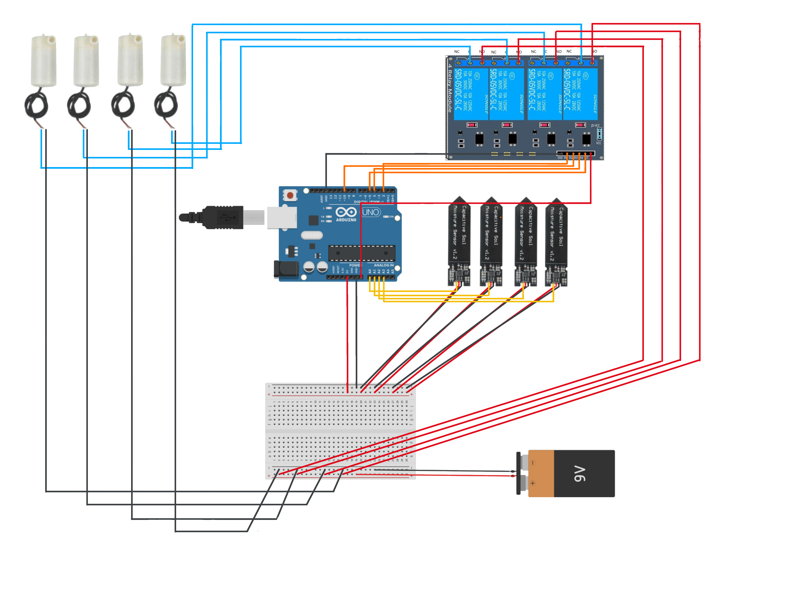

# Automated-Greenhouse

Automated greenhouse system built during CEGEP final project course using Arduno and environmental sensors.
The goal of the project was to monitor greenhouse conditions and automatically control systems such as ventilation watering and empty reservoir alert based on sensor readings.
---

## Overview

The system collects environmental data (humidity, temperature, water-level) and triggers actuators when certain thresholds are reached.
This helps maintain stable growing conditions with minimal manual intervention.

This project combines embedded programming, some basic automation logic, and hardware wiring.

---

## System Design and Wiring

Below are images illustrating the system design and wiring used in the project.

### Early concept
*Note: the annotations in this sketch are in French

### Reservoir alert wiring

### Ventilation & ambient humidity wiring

### Watering system wiring

---

## Notes

This repository currently contains the core Arduino code and wiring documentation.  
Additional components such as data analysis graphs and further documentation may be added later.
